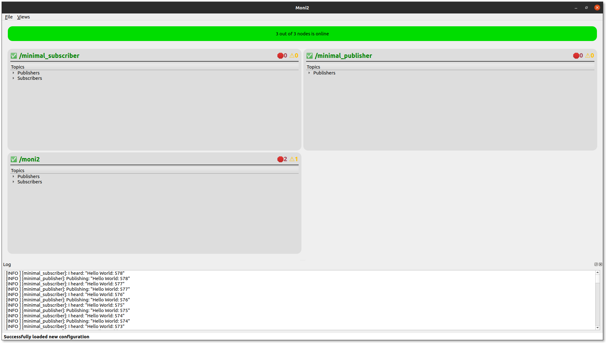
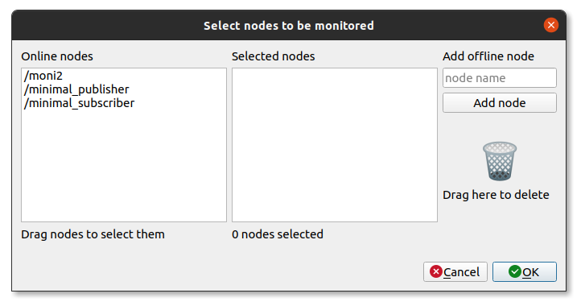
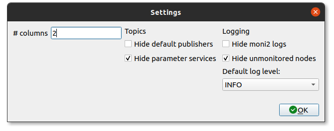

# Moni2 

a ROS2/Python3/Qt5 monitoring tool

## Requirements
* Python >= 3.6
* ROS2 foxy
* PyQt5

## Build
* **Native ROS2**: create a workspace, include this package and run `colcon build`.
* **Docker**: Run the following command:
  ```
  $ cd [somepath]/moni2
  $ docker build -t moni2:latest .
  ```

## Run
* **Native ROS2**:  
  1. `ros2 run moni2 moni2`
  2. `ros2 launch moni2 moni2.launch.py`
* **Docker**: 
  1. `docker run -it --rm -v /tmp/.X11-unix:/tmp/.X11-unix -e DISPLAY=$DISPLAY -u qtuser moni2`

# Windows WSL 2
## Prerequisites
* **Install Windows 10 WSL 2**:
 
 You can install WSL 2 by following the [documentation](https://docs.microsoft.com/en-us/windows/wsl/install) for the default Linux distribution, which is Ubuntu. 
 
* **Install Docker Desktop Backend**:

Docker Desktop WSL 2 Backend can be installed by following this [documentation](https://docs.docker.com/desktop/windows/wsl/). The prerequisites in the document should be followed and the WSL 2 support must be checked when asked during the installation.

* **VcXsrv Windows X Server Installation and Configuration**:

The Windows X Server is required to be able to connect to the display. VcXsrv can be installed [here](https://sourceforge.net/projects/vcxsrv/). The configuration steps are similar to the steps given [here](https://dev.to/darksmile92/run-gui-app-in-linux-docker-container-on-windows-host-4kde).
  
## Build
* **Clone the repository**:
*  Build the repositoy    
  ```
  $ cd [somepath]/moni2
  $ docker build -t moni2:latest .
  ```

## Run
* **WSL**:
  1. Run VcXrsv server
  2. `docker run -it --rm -e DISPLAY={YOUR_IP}:0.0 -u qtuser moni2`
  3. To obtain the IP write ipconfig in CMD.

## Troubleshooting
* **Windows**:
* If "standard_init_linux.go:190: exec user process caused "no such file or directory"" [try](https://stackoverflow.com/questions/51508150/standard-init-linux-go190-exec-user-process-caused-no-such-file-or-directory)
* Or else use git bash, and use 
```
dos2unix Dockerfile 
dos2unix entrypoint.sh
```
* Build again and see if it helps.
* If other problems are encountered please contact one of the developers.

## How to use
The program will look similar to this when you run it:


### Configuration
1. **Create a new configuration** (i.e. select which nodes to monitor):
   * Press `File` (in the menu) and then `New`
   * or press `[ctrl]+[N]`  
   You will see a dialog similar to this:
   
2. **Select nodes**
   * "Online nodes" list contains all current online nodes.
      * these can be dragged to the "Selected node" list.
      * the list should automatically update every 3rd second.
   * "Selected node" list contains the nodes that will be monitored.
      * you can add nodes by dragging from the "Online nodes" or manually add nodes using the input field to the right.
      * you can drag nodes from the trash-can if you wish to delete them.
      * you can drag/drop nodes to reorder them. 
3. **Save configuration**
   * You will be asked to save your configuration somewhere (it is `.json`).
4. **Have fun!**
5. **Edit**
   * You can edit your configuration:
     * Press `File` (in the menu) and then `Edit`
     * or press `[ctrl]+[E]`
 6. **See hidden nodes**
  * Press `File`, `Settings`

### Settings
To open settings:
* Press `File` (in the menu) and then `Settings`
* or press `[ctrl][alt]+[S]`  

