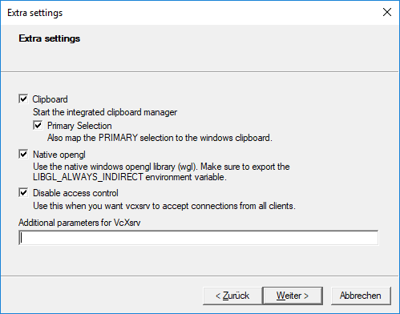

# Moni2 

a ROS2/Python3/Qt5 monitoring tool

## Requirements
* Python >= 3.6
* ROS2 foxy
* PyQt5

## Build
* **Native ROS2**: create a workspace, include this package and run `colcon build`.
* **Docker**: Run the following command:
  ```
  $ cd [somepath]/moni2
  $ docker build -t moni2:latest .
  ```

## Run
* **Native ROS2**:  
  1. `ros2 run moni2 moni2`
  2. `ros2 launch moni2 moni2.launch.py`
* **Docker**: 
  1. `docker run -it --rm -v /tmp/.X11-unix:/tmp/.X11-unix -e DISPLAY=$DISPLAY -u qtuser moni2`

# Windows WSL 2
## Prerequisites
1. **Install Windows 10 WSL 2**:
 
  * You can install WSL 2 by following the [documentation](https://docs.microsoft.com/en-us/windows/wsl/install)(Last visited 28-04-2022) for the default Linux distribution, which is Ubuntu. 
  * If the link doesn't work you can follow these instructions:
    * The Prerequisites to install WSL 2 is that you must be running windows 10 version 2004 (build 19041 and higher) or windows 11 (Windows logo key + R, type winver and select OK; You can update to latest version by Start &#8594; Settings &#8594; Windows Update).
     
    * Install WSL by running the following command in administrator PowerShell or Windows Command Prompt and then restarting your machine.
  ```
  wsl --install
  ```
  * This command will enable the required optional components, download the latest Linux kernel, set WSL 2 as your default, and install a Linux distribution for you (Ubuntu by default, see below to change this).
    * The first time you launch a newly installed Linux distribution, a console window will open and you'll be asked to wait for files to de-compress and be stored on your machine. All future launches should take less than a second.
    * The above command only works if WSL is not installed, if you run `wsl --install` and see the WSL help text, please try running `wsl --list --online` to see a list of availble distros and run `swl --install -d <DistroName>` to install a distro.
 
2. **Install Docker Desktop Backend**:

  * Docker Desktop WSL 2 Backend can be installed by following this [documentation](https://docs.docker.com/desktop/windows/wsl/)(Last visited 28-04-2022). The prerequisites in the document should be followed and the WSL 2 support must be checked when asked during the installation.
  * If the link doesn't work you can follow these instructions:
    * Prerequisites
      * Install Windows 10, version 1903 or higher or Windows 11.
      * Enable WSL 2 feature on Windows.
      * Download and install the [Linux kernel update package](https://docs.microsoft.com/da-dk/windows/wsl/install-manual#step-4---download-the-linux-kernel-update-package).
    * Download [Docker Desktop 2.3.0.2](https://desktop.docker.com/win/main/amd64/Docker%20Desktop%20Installer.exe) or a later release.
    * Follow the usual installation instructions to install Docker Desktop. If you are running a supported system, Docker Desktop prompts you to enable WSL 2 during installation. Read the information displayed on the screen and enable WSL 2 to continue.
    * Start Docker Desktop from the Windows Start menu.
    * From the Docker menu, select Settings &#8594; General.
    * Select the Use WSL 2 based engine check box.
      *   If you have installed Docker Desktop on a system that supports WSL 2, this option will be enabled by default.
    * Click Apply & Restart.
    * Ensure the distribution runs in WSL 2 mode. WSL can run distributions in both v1 or v2 mode.
      *   To check the WSL mode, run: `wsl.exe -l -v`
      *   To upgrade your existing Linux distro to v2, run: `wsl.exe --set-version (distro name) 2`
      *   To set v2 as the default version for future installations, run: `wsl.exe --set-default-version 2`
    *   When Docker Desktop restarts, go to Settings &#8594; Resources &#8594; WSL Integration. 
        *   The Docker-WSL integration will be enabled on your default WSL distribution. To change your default WSL distro, run `wsl --set-default <distro name>`.
      *   Click Apply & Restart.

3. **VcXsrv Windows X Server Installation and Configuration**:

* The Windows X Server is required to be able to connect to the display. VcXsrv can be installed [here](https://sourceforge.net/projects/vcxsrv/)(Last visited 28-04-2022). The configuration steps are similar to the steps given [here](https://dev.to/darksmile92/run-gui-app-in-linux-docker-container-on-windows-host-4kde)(Last visited 28-04-2022).
* If the links to the steps given aren't working follow these instructions:
  * Run the Xlaunch and follow the images to set up the configuration:   
  * Make sure to save the configuration file before you click finish. You can save it in one of the following locations:
    *  %appdata%\Xming
    *  %userprofile%\Desktop
    *  %userprofile%
  
## Build
* **Clone the repository**:
*  Build the docker with the following command:   
  ```
  $ cd [somepath]/moni2
  $ docker build -t moni2:latest .
  ```

## Run
* **WSL**:
  1. Run VcXrsv server
  2. `docker run -it --rm -e DISPLAY={YOUR_IP}:0.0 -u qtuser moni2`
  3. To obtain the IP write 'ipconfig' in CMD.

## Troubleshooting
* **Windows**:
* If `standard_init_linux.go:190: exec user process caused "no such file or directory"` [try](https://stackoverflow.com/questions/51508150/standard-init-linux-go190-exec-user-process-caused-no-such-file-or-directory).
* Or else use git bash, and use: 
```
dos2unix Dockerfile 
dos2unix entrypoint.sh
```
* Build again and see if it helps.
* If other problems are encountered please contact one of the developers.

## How to use
The program will look similar to this when you run it:


### Configuration
1. **Create a new configuration** (i.e. select which nodes to monitor):
   * Press `File` (in the menu) and then `New`
   * or press `[ctrl]+[N]`  
   You will see a dialog similar to this:
   
2. **Select nodes**
   * "Online nodes" list contains all current online nodes.
      * these can be dragged to the "Selected node" list.
      * the list should automatically update every 3rd second.
   * "Selected node" list contains the nodes that will be monitored.
      * you can add nodes by dragging from the "Online nodes" or manually add nodes using the input field to the right.
      * you can drag nodes from the trash-can if you wish to delete them.
      * you can drag/drop nodes to reorder them. 
3. **Save configuration**
   * You will be asked to save your configuration somewhere (it is `.json`).
4. **Have fun!**
5. **Edit**
   * You can edit your configuration:
     * Press `File` (in the menu) and then `Edit`
     * or press `[ctrl]+[E]`
 6. **See hidden nodes**
  * Press `File`, `Settings`

### Settings
To open settings:
* Press `File` (in the menu) and then `Settings`
* or press `[ctrl][alt]+[S]`  

